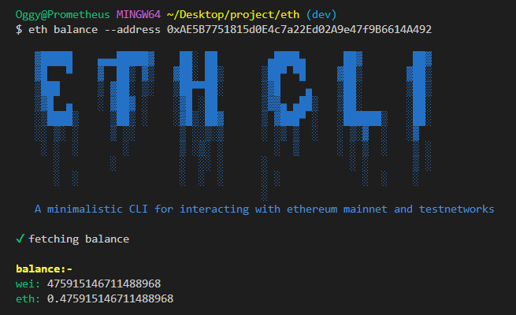
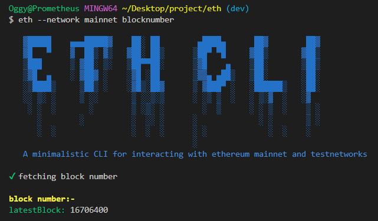
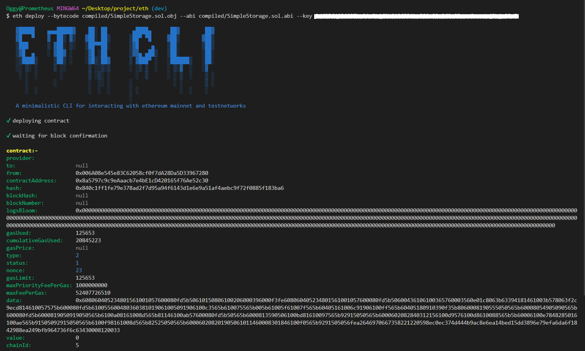
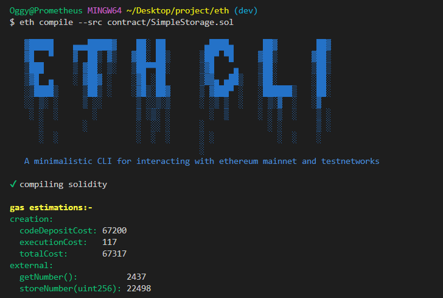

# A minimalistic CLI to interact with ethereum mainnet and testnets

## Install

* run following commands to install eth-cli globally on your local machine
    ```
    git clone https://github.com/oggy107/eth-cli.git
    ```
    ```
    cd eth-cli
    ```
    ```
    yarn install-globally
    ```

run `eth --version` command to check if eth-cli is installed properly


## Usage

```
Usage: eth [options] [command]

Options:
  -V, --version          output the version number
  --network <type>       network to use (choices: "goerli", "mainnet", default: "goerli")
  -h, --help             display help for command

Commands:
  balance [options]      get balance of address
  blocknumber            get latest block number
  block [options]        get block data
  transaction [options]  get transaction data
  compile [options]      compile solidity smart contract. outputs abi and object code   in compiled directory. currently compilation of solidity files without libraries(importing other solidity files) is supported
  deploy [options]       deploy a contract
  interact [options]     interact with already deployed contract
  help [command]         display help for command
```

## Networks

Switch between networks by using `--network` switch before running commands  
*note: default selected network is **goerli testnet** to switch to mainnet use `--network mainnet` switch. currently only **goerli** and **mainet** are supported*

## Getting help

* To get all available commands and their usage
    ```
    eth [--help | -h]
    ```

* To get help with specific command and display its options
    ```
    eth help {command name}
    ```
    or
    ```
    eth {command name} {--help | -h}
    ```

## Available Commands

* Get balance of address
    ```
    eth [--network {network type}] balance--address {public address of account to fetch balance of}
    ```

* Get latest blocknumber of selected network
    ```
    eth [--network {network type}] blocknumber
    ```

* Get data of a block through block number
    ```
    eth [--network {network types}] block --number {block number to fetch data of}
    ```

* Compile solidity code
    ```
    eth compile --src {path to solidity source code}
    ```
    *note: currently compilation of solidity files without libraries(importing other solidity files) is supported*  

    eth-cli will create a new folder in current directory named **compiled** which will contain compiled solidity contract bytecode and also the contract abi

* Deploy smart contract on selected network
    ```
    eth [--network {network type}] deploy --bytecode {path to contract bytecode} --abi {path to contract abi} --key {private key for signing transaction}
    ```

* Interact with already deployed smart contracts
    ```
    eth [--network {network type}] interact --contract {contract address to interact with} --abi {path to contract abi} --method {method call on contract. eg. getNumber()} [--key {private key}]
    ```
    private key is not neccessary for calling view or pure methods because they does not cost gas but you need to supply the private key if you want to call a state changing method on the chain

* Get Transaction data from selected network
    ```
    eth transaction --hash {transaction hash}
    ```

## Examples

* Get balance of address
    ```powershell
    eth balance --address 0xAE5B7751815d0E4c7a22Ed02A9e47f9B6614A492
    ```
    output

    

---

* Get latest block number from ethereum mainnet
    ```
    eth --network mainnet blocknumber
    ```
    output

    

---

* Deploying a smart contract on goerli testnet
    ```
    eth deploy --bytecode compiled/SimpleStorage.sol.obj --abi compiled/SimpleStorage.sol.abi --key {your private key}
    ```
    output

    

---

* Compiling solidity sourcecode
    ```
    eth compile --src contract/SimpleStorage.sol
    ```
    output

    

# Dev section

## TODO

### commands
- [x] get balance
- [x] get block number
- [x] add compiler
- [x] get block data from block number 
- [x] get transaction data from transaction hash 
- [x] deploy contract
- [x] interact with deployed contract 

### features
- [x] add loading indicators or spinners
- [x] beautify output 
- [x] add logger 
- [x] improve error handling 
